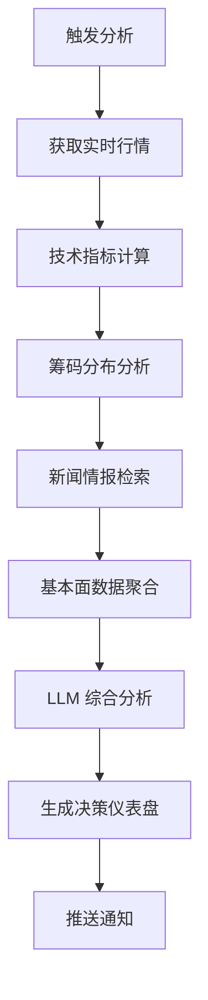

# 📚 股票智能分析系统 - Repowiki

> 项目知识库 | 2026-04-01 更新

---

## 🎯 项目概览

**项目名称**: 股票智能分析系统 (Daily Stock Analysis)  
**定位**: 基于 AI 大模型的 A 股/港股/美股自选股智能分析系统  
**核心价值**: 每日自动分析并推送「决策仪表盘」到多渠道通知平台  
**技术栈**: Python 3.10+ · FastAPI · LiteLLM · React/Vite · Electron  

### 关键指标
- ⭐ **GitHub Stars**: 18,527+ (Trendshift 推荐项目)
- 🐍 **Python 版本**: 3.10+
- 📊 **支持市场**: A 股、港股、美股及主要指数
- 🤖 **AI 模型**: Gemini/GPT/Claude/DeepSeek/Ollama 等
- 📱 **通知渠道**: 企业微信/飞书/Telegram/Discord/Slack/邮件等

---

## 🏗️ 系统架构

### 整体架构图

```
┌─────────────────────────────────────────────────────────────┐
│                        用户界面层                              │
├─────────────────┬─────────────────┬─────────────────────────┤
│   Web 前端       │  桌面客户端      │  Bot 机器人             │
│   (React+Vite)  │  (Electron)    │  (多平台适配)            │
└────────┬────────┴────────┬────────┴──────────┬──────────────┘
         │                 │                    │
         └─────────────────┼────────────────────┘
                           │
                  ┌────────▼────────┐
                  │   FastAPI 服务   │
                  │   (server.py)   │
                  └────────┬────────┘
                           │
         ┌─────────────────┼─────────────────┐
         │                 │                 │
┌────────▼────────┐ ┌─────▼──────┐ ┌────────▼────────┐
│  主调度器        │ │ API 路由     │ │ 定时调度器       │
│  (main.py)      │ │ (api/)     │ │ (scheduler.py)  │
└────────┬────────┘ └────────────┘ └─────────────────┘
         │
         │  ┌──────────────────────────────────┐
         │  │        核心分析流水线              │
         │  │   StockAnalysisPipeline          │
         │  └──────────────────────────────────┘
         │
    ┌────┴─────┬─────────────┬──────────────┬─────────────┐
    │          │             │              │             │
┌───▼───┐ ┌───▼────┐ ┌─────▼─────┐ ┌──────▼──────┐ ┌────▼────┐
│数据获取│ │技术分析│ │新闻检索    │ │LLM 分析      │ │报告生成  │
│模块    │ │模块    │ │模块       │ │引擎         │ │引擎      │
└────────┘ └────────┘ └───────────┘ └─────────────┘ └─────────┘
```

### 目录结构详解

```
daily_stock_analysis/
├── 📁 src/                      # 后端核心逻辑
│   ├── agent/                   # Agent 策略问股系统
│   │   ├── skill_manager.py     # 技能管理器
│   │   ├── orchestrator.py      # 多 Agent 编排器
│   │   └── strategies/          # 策略 YAML 定义
│   ├── core/                    # 主流程编排
│   │   ├── pipeline.py          # 分析流水线
│   │   ├── market_review.py     # 大盘复盘
│   │   └── context_builder.py   # 上下文构建
│   ├── services/                # 业务服务层
│   │   ├── image_extractor.py   # 图片识别
│   │   ├── news_search.py       # 新闻搜索
│   │   └── technical_analysis.py# 技术分析
│   ├── repositories/            # 数据访问层
│   ├── schemas/                 # 数据结构定义
│   └── notification_sender/     # 通知发送器
│
├── 📁 data_provider/            # 数据源适配器
│   ├── akshare_fetcher.py       # AkShare 数据源
│   ├── tushare_fetcher.py       # Tushare 数据源
│   ├── yfinance_fetcher.py      # Yahoo Finance
│   ├── tickflow_fetcher.py      # TickFlow 增强数据
│   └── base.py                  # 基础接口定义
│
├── 📁 api/                      # FastAPI 路由
│   ├── v1/
│   │   ├── analysis.py          # 分析接口
│   │   ├── history.py           # 历史记录
│   │   ├── stocks.py            # 股票数据
│   │   └── system_config.py     # 系统配置
│   └── middlewares/             # 中间件
│
├── 📁 bot/                      # 机器人平台适配
│   ├── commands/                # 命令处理器
│   │   ├── ask.py               # /ask 技能分析
│   │   ├── chat.py              # /chat 自由对话
│   │   └── history.py           # /history 查询
│   └── platforms/               # 平台适配器
│       ├── feishu.py            # 飞书
│       ├── telegram.py          # Telegram
│       └── discord.py           # Discord
│
├── 📁 apps/                     # 前端应用
│   ├── dsa-web/                 # Web 前端 (React+Vite)
│   │   ├── src/
│   │   │   ├── pages/           # 页面组件
│   │   │   ├── components/      # 通用组件
│   │   │   └── api/             # API 调用
│   │   └── dist/                # 构建产物
│   └── dsa-desktop/             # 桌面客户端 (Electron)
│
├── 📁 strategies/               # 交易策略库
│   ├── bull_trend.yaml          # 多头趋势策略
│   ├── chan_theory.yaml         # 缠论策略
│   ├── wave_theory.yaml         # 波浪理论
│   └── ma_golden_cross.yaml     # 均线金叉
│
├── 📁 templates/                # Jinja2 报告模板
│   ├── report_markdown.j2       # Markdown 报告
│   ├── report_wechat.j2         # 企业微信模板
│   └── _macros.j2               # 宏定义
│
├── 📁 scripts/                  # 工具脚本
│   ├── ci_gate.sh               # CI 门禁
│   ├── build-*.sh               # 构建脚本
│   └── check_ai_assets.py       # AI 资产检查
│
├── 📁 .github/                  # GitHub 自动化
│   ├── workflows/               # CI/CD 工作流
│   ├── scripts/                 # 自动化脚本
│   └── instructions/            # Copilot 指令
│
├── 📁 docs/                     # 文档中心
│   ├── full-guide.md            # 完整指南
│   ├── FAQ.md                   # 常见问题
│   ├── CHANGELOG.md             # 更新日志
│   └── architecture/            # 架构文档
│
├── main.py                      # 主调度入口
├── server.py                    # FastAPI 服务入口
├── webui.py                     # WebUI 启动入口
└── pyproject.toml               # 项目配置
```

---

## 🔧 核心技术栈

### 后端技术

| 组件 | 技术选型 | 用途 |
|------|---------|------|
| **语言** | Python 3.10+ | 主开发语言 |
| **Web 框架** | FastAPI | RESTful API 服务 |
| **AI 调用** | LiteLLM | 统一 LLM 接口抽象 |
| **数据处理** | Pandas, NumPy | 行情数据处理 |
| **技术分析** | TA-Lib | 技术指标计算 |
| **任务调度** | APScheduler | 定时任务管理 |
| **数据库** | SQLite | 本地数据存储 |
| **缓存** | LRU Cache | 分析结果缓存 |

### 前端技术

| 模块 | 技术栈 | 说明 |
|------|-------|------|
| **Web 框架** | React 18 + TypeScript | 组件化开发 |
| **构建工具** | Vite 5.x | 快速开发与构建 |
| **UI 组件库** | Ant Design | 企业级 UI 组件 |
| **状态管理** | Zustand | 轻量级状态管理 |
| **HTTP 客户端** | Axios | API 请求封装 |
| **图表库** | ECharts | K 线与可视化 |
| **桌面端** | Electron 28+ | 跨平台桌面应用 |

### 数据源与 API

#### 行情数据
- **AkShare**: A 股/港股实时行情（主力）
- **Tushare Pro**: 复权数据与财务指标（需 Token）
- **YFinance**: 美股历史与实时数据
- **Pytdx**: A 股实时行情备选
- **Baostock**: A 股历史数据备选
- **TickFlow**: 增强型 A 股指数数据（可选）

#### 新闻与搜索
- **Tavily**: AI 优化搜索引擎
- **SerpAPI**: 全渠道搜索（Google/Bing）
- **Bocha**: 博查搜索（中文优化）
- **Brave Search**: 隐私优先搜索
- **MiniMax**: 结构化搜索结果

#### 社交舆情（美股专用）
- **Stock Sentiment API**: Reddit/X/Polymarket 情绪分析

---

## 🚀 核心功能模块

### 1. 智能分析引擎

#### 分析流程


#### 输入输出
- **输入**: 股票代码列表（如 `600519,hk00700,AAPL`）
- **输出**: 
  - 决策仪表盘（Markdown/HTML）
  - 买卖点位建议
  - 风险评估报告
  - 操作检查清单

#### 关键算法
```python
# 乖离率阈值控制（默认 5%）
def check_bias_risk(current_price: float, ma5: float) -> bool:
    bias = abs(current_price - ma5) / ma5 * 100
    return bias > BIAS_THRESHOLD  # 超阈值提示风险

# 多头排列判断
def is_bullish_alignment(ma5: float, ma10: float, ma20: float) -> bool:
    return ma5 > ma10 > ma20  # 严格多头排列
```

### 2. Agent 策略问股系统

#### 架构设计
```
┌─────────────────────────────────────┐
│         用户自然语言提问             │
│   "用缠论分析 600519 的买点"         │
└─────────────┬───────────────────────┘
              │
┌─────────────▼───────────────────────┐
│      Skill Manager (技能管理器)      │
│  - 解析意图                          │
│  - 匹配策略技能                      │
│  - 编排工具调用                      │
└─────────────┬───────────────────────┘
              │
    ┌─────────┼─────────┐
    │         │         │
┌───▼───┐ ┌──▼───┐ ┌───▼───┐
│行情工具│ │K 线工具│ │新闻工具│
└───┬───┘ └──┬───┘ └───┬───┘
    │        │         │
    └────────┼─────────┘
             │
┌────────────▼───────────────────────┐
│      LLM 推理引擎 (LiteLLM)         │
│  - 流式输出思考路径                 │
│  - 多轮对话上下文保护               │
└────────────┬───────────────────────┘
             │
┌────────────▼───────────────────────┐
│         结构化回答生成              │
│  - 买入/卖出/观望建议               │
│  - 精确点位与止损                   │
└────────────────────────────────────┘
```

#### 内置策略技能库
| 策略 ID | 名称 | 适用场景 |
|--------|------|---------|
| `bull_trend` | 多头趋势 | 上升趋势跟踪 |
| `chan_theory` | 缠论 | 中枢与背驰分析 |
| `wave_theory` | 波浪理论 | 浪型推演 |
| `ma_golden_cross` | 均线金叉 | 短线突破 |
| `bottom_volume` | 底部放量 | 反转信号 |
| `dragon_head` | 龙头战法 | 强势股追涨 |
| `emotion_cycle` | 情绪周期 | 市场情绪博弈 |
| `shrink_pullback` | 缩量回调 | 低吸策略 |
| `volume_breakout` | 放量突破 | 量能驱动 |
| `box_oscillation` | 箱体震荡 | 区间交易 |
| `one_yang_three_yin` | 一阳三阴 | K 线形态 |

#### 配置文件示例 (`strategies/bull_trend.yaml`)
```yaml
id: bull_trend
name: 多头趋势策略
description: 适用于 MA5>MA10>MA20 的多头排列行情
tools:
  - get_realtime_quotes
  - get_kline_data
  - calculate_ma
  - search_news
prompt_template: |
  你是一位趋势交易专家，请根据以下技术分析数据...
rules:
  - 乖离率超过 5% 不追高
  - 必须呈现多头排列
  - 设置明确止损位
```

### 3. 多渠道通知系统

#### 支持渠道
| 渠道 | 配置项 | 特点 |
|------|-------|------|
| **企业微信** | `WECHAT_WEBHOOK_URL` | Markdown 图文卡片 |
| **飞书** | `FEISHU_WEBHOOK_URL` | 富文本卡片 |
| **Telegram** | `TELEGRAM_BOT_TOKEN` | 支持图片发送 |
| **Discord** | `DISCORD_WEBHOOK_URL` | Embed 消息 |
| **Slack** | `SLACK_BOT_TOKEN` | Block Kit 布局 |
| **邮件** | `EMAIL_*` | HTML 格式 |
| **PushPlus** | `PUSHPLUS_TOKEN` | 国内推送服务 |
| **Server 酱** | `SERVERCHAN3_SENDKEY` | 微信推送 |

#### 通知模式
- **批量推送**: 所有股票分析完成后一次性推送（默认）
- **单股推送**: 每分析完一只立即推送 (`--single-notify`)
- **合并推送**: 个股与大盘复盘合并为一封邮件 (`MERGE_EMAIL_NOTIFICATION=true`)

#### 图片转换
```bash
# 配置转图渠道
MARKDOWN_TO_IMAGE_CHANNELS=telegram,wechat,email

# 选择转图引擎
MD2IMG_ENGINE=wkhtmltoimage  # 或 markdown-to-file
```

### 4. 数据源 Fallback 机制

#### 优先级策略
```python
# 板块涨跌榜 fallback 顺序
def fetch_sector_rankings():
    try:
        return akshare_adapter()  # EM -> Sina
    except Exception:
        try:
            return tushare_adapter()
        except Exception:
            return efinance_adapter()
```

#### 超时控制
- **软超时**: 超时后降级继续主流程（fail-open）
- **硬超时**: 子进程隔离 + kill（未来可升级）
- **阶段预算**: `FUNDAMENTAL_STAGE_TIMEOUT_SECONDS=30`

---

## 🌐 部署方案

### 方案一：GitHub Actions（零成本）

#### 优势
- ✅ 无需服务器
- ✅ 自动定时执行（工作日 18:00）
- ✅ 免费额度充足
- ✅ 配置简单（5 分钟完成）

#### 工作流文件
```yaml
# .github/workflows/daily_analysis.yml
name: 每日股票分析

on:
  schedule:
    - cron: '0 10 * * 1-5'  # UTC 10:00 = 北京时间 18:00
  workflow_dispatch:
    inputs:
      force_run:
        description: '跳过交易日检查强制执行'
        required: false
        default: 'false'

jobs:
  analyze:
    runs-on: ubuntu-latest
    steps:
      - uses: actions/checkout@v4
      - name: Set up Python
        uses: actions/setup-python@v5
        with:
          python-version: '3.10'
      - name: Install dependencies
        run: pip install -r requirements.txt
      - name: Run analysis
        env:
          STOCK_LIST: ${{ secrets.STOCK_LIST }}
          GEMINI_API_KEY: ${{ secrets.GEMINI_API_KEY }}
          WECHAT_WEBHOOK_URL: ${{ secrets.WECHAT_WEBHOOK_URL }}
        run: python main.py --schedule
```

### 方案二：Docker 部署

#### Dockerfile 关键配置
```dockerfile
FROM python:3.10-slim

WORKDIR /app

# 安装系统依赖
RUN apt-get update && apt-get install -y \
    wkhtmltopdf \
    && rm -rf /var/lib/apt/lists/*

# 安装 Python 依赖
COPY requirements.txt .
RUN pip install --no-cache-dir -r requirements.txt

# 复制代码
COPY . .

# 构建前端（可选）
RUN cd apps/dsa-web && npm ci && npm run build

CMD ["python", "main.py", "--webui"]
```

#### Docker Compose
```yaml
version: '3.8'

services:
  stock-analysis:
    build: .
    ports:
      - "8000:8000"
    environment:
      - STOCK_LIST=600519,hk00700,AAPL
      - GEMINI_API_KEY=${GEMINI_API_KEY}
      - WECHAT_WEBHOOK_URL=${WECHAT_WEBHOOK_URL}
    volumes:
      - ./data:/app/data
      - ./logs:/app/logs
    restart: unless-stopped
```

### 方案三：本地开发部署

#### 环境准备
```bash
# 克隆项目
git clone https://github.com/ZhuLinsen/daily_stock_analysis.git
cd daily_stock_analysis

# 创建虚拟环境
python -m venv venv
source venv/bin/activate  # Windows: venv\Scripts\activate

# 安装依赖
pip install -r requirements.txt

# 配置环境变量
cp .env.example .env
vim .env  # 编辑配置
```

#### 运行模式
```bash
# 单次分析
python main.py

# 调试模式
python main.py --debug

# 仅大盘复盘
python main.py --market-review

# 启动 Web 界面
python main.py --webui

# 仅 API 服务
python main.py --serve-only

# 使用 uvicorn 直接启动
uvicorn server:app --reload --host 0.0.0.0 --port 8000
```

---

## 🔐 安全与认证

### Web 管理认证

#### 启用方式
```bash
# .env 配置
ADMIN_AUTH_ENABLED=true
```

#### 安全特性
- **首次访问**: 网页设置初始密码
- **会话管理**: Cookie-based Session
- **密码存储**: bcrypt 哈希加密
- **CSRF 保护**: 表单提交验证
- **多 Worker 兼容**: 重启后统一状态

#### 运行时开关
```python
# 开启认证
PUT /api/v1/system/config
{
  "items": [{"key": "ADMIN_AUTH_ENABLED", "value": "true"}]
}

# 关闭认证（保留密码）
PUT /api/v1/system/config
{
  "items": [{"key": "ADMIN_AUTH_ENABLED", "value": "false"}]
}
```

### 敏感信息保护

#### 掩码机制
- 配置返回时敏感字段显示 `******`
- 导入导出保持原文
- 版本冲突保护（乐观锁）

#### 最佳实践
```bash
# ✅ 推荐：使用 GitHub Secrets
STOCK_LIST=600519  # 非敏感
GEMINI_API_KEY=${{ secrets.GEMINI_API_KEY }}  # 敏感

# ❌ 禁止：硬编码密钥
OPENAI_API_KEY=sk-xxxx  # 不要提交到仓库
```

---

## 📊 API 规范

### 核心接口

#### 1. 触发分析
```http
POST /api/v1/analysis/analyze
Content-Type: application/json

{
  "stock_codes": ["600519", "000858"],
  "report_type": "full",
  "async_mode": true
}
```

**响应**:
```json
{
  "task_id": "abc123def456",
  "status": "pending",
  "message": "Analysis task accepted"
}
```

#### 2. 查询历史
```http
GET /api/v1/history?stock_code=600519&page=1&limit=20
```

#### 3. SSE 实时推送
```http
GET /api/v1/analysis/tasks/stream
```

**事件类型**:
- `connected`: 连接成功
- `task_created`: 新任务创建
- `task_started`: 任务开始执行
- `task_completed`: 任务完成
- `heartbeat`: 心跳（30 秒间隔）

#### 4. 系统配置
```http
GET /api/v1/system/config?include_schema=true

PUT /api/v1/system/config
{
  "config_version": "2026-02-09T13:20:31Z:sha256:4f9a...",
  "items": [
    {"key": "STOCK_LIST", "value": "600519,000858"}
  ]
}
```

---

## 🛠️ 开发指南

### 代码规范

#### Python 风格
```python
# 类型注解
def calculate_ma(prices: List[float], period: int) -> float:
    """计算移动平均线"""
    pass

# 异常处理
try:
    result = fetch_data()
except DataProviderError as e:
    logger.warning(f"数据获取失败：{e}")
    result = fallback_fetch()
```

#### 前端规范
```typescript
// TypeScript 接口
interface StockQuote {
  stock_code: string;
  current_price: number;
  change_percent: number;
}

// React 组件
const StockCard: React.FC<{ stock: StockQuote }> = ({ stock }) => {
  return <div>{stock.stock_code}</div>;
};
```

### 测试策略

#### 单元测试
```bash
# 运行测试
pytest tests/ -v

# 仅离线测试
pytest -m "not network"

# 覆盖率报告
pytest --cov=src --cov-report=html
```

#### CI 门禁
```bash
# 本地执行 CI 检查
./scripts/ci_gate.sh

# 检查 AI 资产一致性
python scripts/check_ai_assets.py
```

### 调试技巧

#### 日志级别
```python
import logging
logger = logging.getLogger(__name__)

logger.debug("调试信息")
logger.info("一般信息")
logger.warning("警告")
logger.error("错误")
```

#### 环境变量调试
```bash
# 启用详细日志
export LOG_LEVEL=DEBUG

# 跳过代理
export USE_PROXY=false

# 强制刷新缓存
export FORCE_REFRESH=true
```

---

## 📈 性能优化

### 缓存策略

#### 分析结果缓存
- **缓存键**: `query_id + timestamp`
- **过期时间**: 当日有效
- **刷新机制**: `force_refresh=true`

#### 数据预取
```python
# 实时行情预取（减少串行等待）
PREFETCH_REALTIME_QUOTES=true

# 并发线程池
MAX_WORKERS=3  # 默认并发数
```

### 异步处理

#### 任务队列
```python
from concurrent.futures import ThreadPoolExecutor

executor = ThreadPoolExecutor(max_workers=MAX_WORKERS)

# 提交任务
future = executor.submit(analyze_stock, stock_code)
result = future.result(timeout=300)
```

#### SSE 流式推送
- 避免轮询
- 实时反馈进度
- 心跳保活（30 秒）

---

## 🔄 版本演进

### 里程碑版本

#### v1.0.0 (初始版本)
- ✅ 基础分析功能
- ✅ GitHub Actions 集成
- ✅ 企业微信/飞书推送

#### v2.0.0 (Web 界面)
- ✅ FastAPI 服务
- ✅ React 前端
- ✅ Docker 部署

#### v3.0.0 (Agent 问股)
- ✅ 策略技能系统
- ✅ 多轮对话
- ✅ 流式反馈

#### v3.5.0 (UI 升级)
- ✅ 浅色主题
- ✅ 智能导入（图片/CSV/粘贴）
- ✅ 搜索补全（拼音/别名）

#### v4.0.0 (规划中)
- 🎯 回测系统增强
- 🎯 持仓管理
- 🎯 多账户支持

### 兼容性承诺

#### API 版本控制
- `/api/v1/`: 当前稳定版
- 破坏性变更升级主版本号
- 旧版本保留 6 个月过渡期

#### 数据迁移
- SQLite schema 变更提供迁移脚本
- `.env` 配置向后兼容
- 废弃字段保留读取兼容

---

## 🤝 贡献生态

### 角色分工

| 角色 | 职责 | 权限 |
|------|------|------|
| **Maintainer** | 项目维护 | Merge PR, Release |
| **Committer** | 代码审查 | Review PR |
| **Contributor** | 提交代码 | Create PR |
| **User** | 使用反馈 | Open Issue |

### 提交流程


### Commit 规范
```bash
# 格式
<type>(<scope>): <subject>

# 示例
feat(agent): 添加缠论策略技能
fix(api): 修复历史记录分页 bug
docs(readme): 更新部署指南
```

---

## 📞 社区与支持

### 官方渠道
- **GitHub**: [Issues](https://github.com/ZhuLinsen/daily_stock_analysis/issues)
- **邮箱**: zhuls345@gmail.com
- **赞助商**: [AIHubMix](https://serpapi.com/baidu-search-api?utm_source=github_daily_stock_analysis)

### 第三方资源
- **Trendshift**: [项目页面](https://trendshift.io/repositories/18527)
- **HelloGitHub**: [推荐项目](https://hellogithub.com/repository/ZhuLinsen/daily_stock_analysis)

### 学习资源
- [FastAPI 官方文档](https://fastapi.tiangolo.com/)
- [LiteLLM 文档](https://litellm.vercel.app/)
- [React 官方教程](https://react.dev/)
- [AkShare 文档](https://akshare.akfamily.xyz/)

---

## ⚠️ 免责声明

本项目仅供**学习和研究**使用，不构成任何投资建议。

- 📉 **股市有风险**: 历史表现不代表未来收益
- 🤖 **AI 局限性**: 模型可能产生错误或过时信息
- 🔍 **独立判断**: 请结合个人风险承受能力决策
- 📊 **数据延迟**: 实时行情可能存在 15 分钟延迟

作者不对使用本项目产生的任何损失负责。

---

## 📝 许可证

**MIT License** © 2026 ZhuLinsen

允许商业使用、修改和分发，但需保留原始版权声明。

---

*最后更新：2026-04-01*  
*维护者：ZhuLinsen*  
*本文档由 Repowiki 生成器自动构建*
